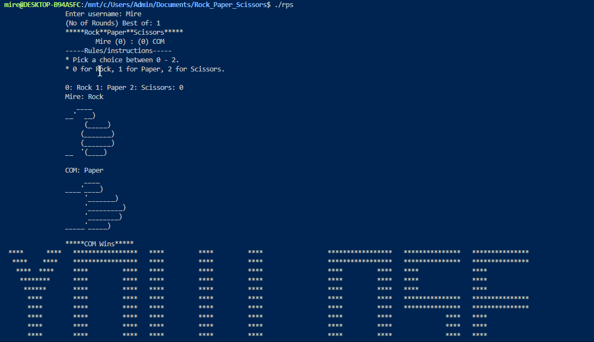

# Rock Paper Scissors

### A console game of R.P.S written by Mire

[USAGE](./README.md)

**_Without Compilation_**
 - Download the rps file and run `./rps` on your console;
 - Enter Username and Number of rounds to play; *Odd numbers make better games tho(Just a suggestion)*;
 - follow instructions
 - Enjoy your game 🚀🚀
  
**_Compile and Run_**
1. fork/clone this repo;
2. run `gcc -o [name] main.c gameplay.c handsigns.c` on your terminal;
3. run `./[name]`;
4. Continue from step 2 of *without compilation*

## Preview

### Contributions
#### Contributions are accepted.
_Guidelines_
- Fork repo
- make changes or addition as desired
- Make a Pull request
## **Or**
- Open an issue and i'll have it fixed in time.